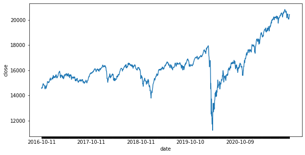
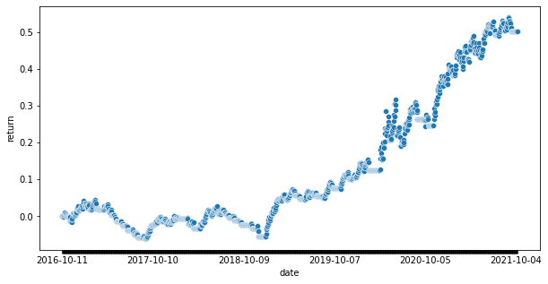

```python
%load_ext autoreload
%autoreload 2
```


```python
import pathlib
import sys
import os
```


```python
def setupSysPath():
    cwd = os.getcwd()
    parent = str(pathlib.Path(cwd).parent)
    if parent not in sys.path:
        sys.path.insert(0, parent)
    return
```


```python
setupSysPath()
```

# HC

NB: points marked with ** are to do items, which I've added in hindsight whilst writing up the narrative.


```python
import itertools
import datetime
```


```python
import hc.data.fmp as fmp
import hc.ranges.ranges as ranges
import hc.utils.ranges as rangeUtils
import hc.utils.scores as scores
import hc.utils.labels as labels
import hc.utils.ml as ml
```

The ranges here are convenience classes with methods like map, fold, filter, etc., so I can write more 'functional' code (in a LISP sense of functional).


```python
CAPITAL = 100
# 'S&P/TSX Composite index'
TICKER = "^GSPTSE"
STOP_LOSS = 0.005
MA_WINDOW = 26
EVENT_MA_WINDOW = 13
VOL_CUTOFF = 150
```

### Strategy - Exploration


```python
snp = fmp.getHistoricalDaily(TICKER)
```


```python
snpClose = snp.toClass(ranges.PriceRange, price = fmp.fmpClose)
snpDates = snp.toClass(ranges.DateRange, date = fmp.fmpDate)
```


```python
(snpClose
 .zipWith(snpDates)
 .t()
 .toLinePlot(cols = ["close", "date"], x = "date", y = "close", legend = False)
)
```


    

    


For data, I originally started with SPY, but changed to the above combined S&P / TSX as a test to see how much I'd overfit my approach to that one particular time series.


```python
(snpClose
 .lWindowDiff(2)
 .zipWith(
     snpClose.lWindowDiff(2).map(labels.labelPosNegZero),
     snpDates
 )
 .t()
 .toScatterPlot(
     cols = ["delta", "direction", "date"], 
     x = "date", 
     y = "delta",
     categoryKey = "direction"
 )
)
```


    

    


We can see that there have generally been more up than down days over our time frame, with the two categories spread relatively evenly over the period.


```python
(snpClose
 .lWindowDiff(2)
 .filterZero(False)
 .zipWith(
     snpClose.lWindowDiff(2).filterZero(False).map(labels.labelPosNeg)
 )
 .t()
 .toHistPlot(
     cols = ["delta", "direction"], 
     x = "delta", 
     y = None,
     categoryKey = "direction"
 )
)
```


    

    


Even though the distribution is weighted to the right of zero, the negative tail reaches further than the positive.

** Need the mean, standard deviation, skew, etc.


```python
(snpClose
 .lWindowDiff(2).take(snpClose.length() - 1)
 .zipWith(snpClose.lWindowDiff(2).tail(snpClose.length() - 1))
 .t()
 .appendOne(snpClose.lWindowDiff(2).tail(snpClose.length() - 1).map(labels.labelPosNegZero))
 .toJointDensityPlot(
     cols = ["delta (T - 0)", "delta (T - 1)", "direction"], 
     x = "delta (T - 0)", 
     y = "delta (T - 1)",
     categoryKey = "direction"
 )
)
```


    

    


There is perhaps a slight correlation between a positive price change yesterday and one today, but it's not clear cut from the graph.

** In hindsight I should probably have taken a correlation coefficient on two binary series to measure this more rigorously.

### Strategy - EWMA Momentum


```python
(rangeUtils.join(
    snpClose,
    snpClose.wma(ranges.ExpWeights.fromWindow(MA_WINDOW)),
    snpClose.wma(ranges.ExpWeights.fromWindow(200))
)
 .zipWith(
     rangeUtils.join(
         rangeUtils.repeat("1D", snp.length(), ranges.Range),
         rangeUtils.repeat(str(MA_WINDOW) + "D", snp.length(), ranges.Range),
         rangeUtils.repeat("200D", snp.length(), ranges.Range)
     ),
     snpDates.repeat(3).join()
 )
 .t()
 .toLinePlot(
     cols = ["ewma", "window", "date"], 
     x = "date", y = "ewma", categoryKey = "window"
 )
)
```


    

    


Plotting price against two windows of exponentially weighted moving average, we can see that the 1D (price) tends to re-join the 26D from above higher than when it initially exceeded it.

Likewise, it probably also tends to rejoin from below lower than the point at which it initially fell below.

** This could also in hindsight have done with a correlation coefficient over a boolean series of whether the next 1D-26D crossing point was higher / lower than the last, given it departed upwards / downwards.


```python
(snpClose
 .subtract(snpClose.wma(ranges.ExpWeights.fromWindow(MA_WINDOW)))
 .take(snpClose.length() - 1)
 .zipWith(
     snpClose.lWindowDiff(2).tail(snpClose.length() - 1),
     (snpClose
      .subtract(snpClose.wma(ranges.ExpWeights.fromWindow(MA_WINDOW)))
      .take(snpClose.length() - 1)
      .map(labels.labelPosNegZero)
     )
 )
 .t()
 .toJointDensityPlot(
     cols = ["close - ewma " + str(MA_WINDOW) + "D", "delta", "indicator"], 
     x = "delta", 
     y = "close - ewma " + str(MA_WINDOW) + "D",
     categoryKey = "indicator"
 )
)
```


    

    


This somewhat makes sense, given that the weight of the orange cluster seems to fall somewhat to the right of zero (ie. the daily price change tends to be positive if already above the 26D EWMA).

Though, it's less clear whether this also holds on the downside.

** Need the mean, standard deviation, skew, etc.


```python
snpCloseIndicator = snpClose.subtract(snpClose.wma(ranges.ExpWeights.fromWindow(MA_WINDOW)))
```

This suggests a +1 / 0 / -1 indicator, simply capturing whether the price is currently above, equal to, or below the 26D EWMA.


```python
(snpCloseIndicator
 .booleanIndicator()
 .weightedAlloc(snpClose, CAPITAL, stopLoss = None)
 .pnl(snpClose)
 .rocCum(CAPITAL)
 .zipWith(
     snpDates,
     (snpCloseIndicator
      .booleanIndicator()
      .map(labels.labelPosNegZero)
     )
 )
 .t()
 .toScatterPlot(
     cols = ["return", "date", "position"], 
     x = "date", 
     y = "return",
     categoryKey = "position"
 )
)
```


    

    


Here, we can see a plot of the cumulative return on a strategy where we go 100% long or short, depending on the value of the indicator.

** Need return volatility, sharpe.


```python
(snpCloseIndicator
 .booleanIndicator()
 .weightedAlloc(snpClose, CAPITAL, stopLoss = STOP_LOSS)
 .pnl(snpClose)
 .rocCum(CAPITAL)
 .zipWith(
     snpDates,
     (snpCloseIndicator
      .booleanIndicator()
      .map(labels.labelPosNegZero)
     )
 )
 .t()
 .toScatterPlot(
     cols = ["return", "date", "position"], 
     x = "date", 
     y = "return",
     categoryKey = "position"
 )
)
```


    

    


In the previous graph, it seems that - particularly at periods of high volatility - we tend to stay with our positions too long after they start losing.

Instead, here, we have a 0.005 stop loss, beyond which we cut our position to zero (and remain there until the indicator changes).


```python
(snpCloseIndicator
 .booleanIndicator(longOnly = True)
 .weightedAlloc(snpClose, CAPITAL, stopLoss = None)
 .pnl(snpClose)
 .rocCum(CAPITAL)
 .zipWith(snpDates)
 .t()
 .toScatterPlot(
     cols = ["return", "date"],
     x = "date", 
     y = "return"
 )
)
```


    

    


Alternatively, we can see in the original graph, that we tend to be short in our down-periods more often than long.

Here, we can see a long-only version (without a stop loss).

** Cross reference this with assets that had less of an overall up-trend over the period.


```python
(snpCloseIndicator
 .booleanIndicator(longOnly = True)
 .weightedAlloc(snpClose, CAPITAL, stopLoss = STOP_LOSS)
 .pnl(snpClose)
 .rocCum(CAPITAL)
 .zipWith(snpDates)
 .t()
 .toScatterPlot(
     cols = ["return", "date", "position"], 
     x = "date", 
     y = "return"
 )
)
```


    

    


Where a long-only plus stop loss can also be seen here.

** Need return volatility, sharpe, etc. on all of the return charts here...

### Strategy - Volatility Adjustment


```python
VOL_WINDOW = 6
```


```python
(rangeUtils.join(
    snpClose,
    snpClose.wma(ranges.ExpWeights.fromWindow(MA_WINDOW)),
    snpClose.wma(ranges.ExpWeights.fromWindow(200))
)
 .zipWith(
     rangeUtils.join(
         rangeUtils.repeat("1D", snpClose.length(), ranges.Range),
         rangeUtils.repeat(str(MA_WINDOW) + "D", snpClose.length(), ranges.Range),
         rangeUtils.repeat("200D", snpClose.length(), ranges.Range)
     ),
     snpDates.repeat(3).join()
 )
 .t()
 .toLinePlot(
     cols = ["ewma", "window", "date"], 
     x = "date", y = "ewma", categoryKey = "window"
 )
)
```


    

    


Looking again at the price over time, and matching this up with our long / short (no stop loss) return graph, our losses tend to cluster at periods of higher volatility (below).


```python
(snpClose
 .wmstd(ranges.ExpWeights.fromWindow(VOL_WINDOW))
 .zipWith(snpDates)
 .t()
 .toScatterPlot(
     cols = ["ewmstd " + str(VOL_WINDOW) + "D", "date"], 
     x = "date", 
     y = "ewmstd " + str(VOL_WINDOW) + "D"
 )
)
```


    

    


Eye-balling the EWM STD suggests c. 150 as a cut-off for unusual levels of volatility.


```python
snpCloseAdjIndicator = (
    snpClose
     .wmstd(ranges.ExpWeights.fromWindow(VOL_WINDOW))
     .zipWith(snpCloseIndicator.booleanIndicator())
     .map(lambda vv: vv[1] if vv[0] < VOL_CUTOFF else 0)
)
```

With this, we can develop a new indicator, following the same momentum strategy as before, but with a circuit breaker above EWM STD == 150.


```python
(snpCloseAdjIndicator
 .booleanIndicator()
 .weightedAlloc(snpClose, CAPITAL, stopLoss = None)
 .pnl(snpClose)
 .rocCum(CAPITAL)
 .zipWith(
     snpDates,
     (snpCloseAdjIndicator
      .booleanIndicator()
      .map(labels.labelPosNegZero)
     )
 )
 .t()
 .toScatterPlot(
     cols = ["return", "date", "position"], 
     x = "date", 
     y = "return", 
     categoryKey = "position"
 )
)
```


    

    


When the EWM STD goes above 150, we cut our position to zero and wait.

Whilst this slightly under-performs the stop loss, it probably has more room for improvement (without just over-fitting) - eg. by using a forward indicator of volatility rather than the backward EWM STD.


```python
(snpCloseAdjIndicator
 .booleanIndicator(longOnly = True)
 .weightedAlloc(snpClose, CAPITAL, stopLoss = None)
 .pnl(snpClose)
 .rocCum(CAPITAL)
 .zipWith(snpDates)
 .t()
 .toScatterPlot(
     cols = ["return", "date"], 
     x = "date", 
     y = "return"
 )
)
```


    

    


### Strategy - EWMA Momentum weighted by Key US Economic Dates

The idea with the EWMA is, at least partly, that dates closer to the present are more informative about the near future than those further away.

An interesting extension of this is then to weight the data by an alternative measure of informative-ness - eg. if there was a relevant economic data announcement.


```python
usEconEvents = (
    fmp
    .getCalendar(datetime.date(2017, 1, 1), datetime.date(2021, 7, 1))
    .filter(fmp.eventHasCountry("US"))
    .filter(lambda e: (
        "WASDE" not in e["event"]
        and "EIA" not in e["event"]
        and "1920" not in e["event"]
        and "2021" not in e["event"]
    ))
)
fmp.summariseCalendar(usEconEvents)
```


    {'Length': 5344,
     'Min Date': '2019-12-23',
     'Max Date': '2021-06-30',
     'Example': {'event': 'United States Cold Storage Cold Storage Beef Stocks',
      'date': '2019-12-23',
      'country': 'US',
      'actual': 480.382,
      'previous': 466.219,
      'change': 14.163,
      'changePercentage': 0.0304,
      'estimate': None}}


```python
(usEconEvents
 .map(lambda e: e["event"])
 .unique()
 .take(20)
 .toList()
)
```


    ['10-Year Note Auction',
     '2-Year Note Auction',
     '20-Year Bond Auction',
     '3-Month Bill Auction',
     '3-Year Note Auction',
     '30-Year Bond Auction',
     '4-Week Bill Auction',
     '5-Year Note Auction',
     '52-Week Bill Auction',
     '6-Month Bill Auction',
     '7-Year Note Auction',
     'ADP Employment Change',
     'API Weekly Crude Oil Stock',
     'Average Hourly Earnings (MoM)',
     'Average Hourly Earnings (YoY)',
     'Average Weekly Hours',
     'Baker Hughes US Oil Rig Count',
     'Bank Stress Test Info',
     'Building Permits (MoM)',
     'Building Permits Change']


One issue with the event data, is that blocks of events which would intuitively sit as one 'category' (eg. bill auction) appear separately.

Furthermore, we have separate event names for clusters of related events (which either appear on the same date, or only differ because of a delay in one series in the past).

This made it very difficult to automatically pick out the informative events.


```python
usEconEventsClusters = ml.clusterEventsByTextEmbedding(
    usEconEvents, 
    model = "kmeans",
    embedding = "glove",
    n_clusters = 80
)
```

Instead, I eventually decide to cluster the events by a glove embedding of their name, to try and group together events which the market would consider in the same 'series'. 


```python
(usEconEvents
 .map(lambda e: e["event"])
 .unique()
 .groupBy(lambda e: usEconEventsClusters[e])
 .map(lambda es: es.toList())
 .take(10)
 .toList()
)
```


    [['Average Hourly Earnings (YoY)',
      'Consumer Price Index (MoM)',
      'Consumer Price Index (YoY)',
      'Consumer Price Index n.s.a (MoM)',
      'Export Price Index (MoM)',
      'Export Price Index (YoY)',
      'Housing Price Index (MoM)',
      'Import Price Index (MoM)',
      'Import Price Index (YoY)',
      'Producer Price Index (MoM)',
      'Producer Price Index (YoY)',
      'Redbook Index (MoM)',
      'Redbook Index (YoY)'],
     ['Building Permits Change',
      'United States Budget Personal Income MM',
      'United States Build Permits revised Build Permits R Chg MM',
      'United States Build Permits revised Build Permits R Numb',
      'United States Construction Construction Spending MM',
      'United States Consumption Personal Consump Real MM',
      'United States House Starts Build Permits: Change MM',
      'United States House Starts Build Permits: Change MM ',
      'United States House Starts Building Permits: Number',
      'United States House Starts Building Permits: Number ',
      'United States Housing Stats House Starts MM: Change',
      'United States Housing Stats House Starts MM: Change ',
      'United States Pending homes Pending Sales Change MM'],
     ['United States CPI Real Weekly Earnings MM',
      'United States Consumption Core PCE Price Index MM',
      'United States Consumption Core PCE Price Index YY',
      'United States Consumption PCE Price Index MM',
      'United States Consumption PCE Price Index YY',
      'United States GDP Advance Core PCE Prices Advance',
      'United States GDP Advance PCE Prices Advance',
      'United States GDP Final Core PCE Prices Fnal',
      'United States Leading indicator Leading Index Chg MM',
      'United States PCE Price Index Dallas Fed PCE'],
     ['United States ISM   man ISM Manuf Employment Idx',
      'United States ISM   man ISM Manuf New Orders Idx',
      'United States ISM   man ISM Manufacturing PMI',
      'United States ISM   man ISM Mfg Prices Paid',
      'United States ISM   non man ISM N Mfg Bus Act',
      'United States ISM   non man ISM N Mfg Employment Idx',
      'United States ISM   non man ISM N Mfg New Orders Idx',
      'United States ISM   non man ISM N Mfg PMI',
      'United States ISM   non man ISM N Mfg Price Paid Idx',
      'United States New York NAPM index ISM NY Biz Conditions'],
     ['United States Chicago PMI Chicago PMI',
      'United States Composite PMI Markit Comp Flash PMI',
      'United States Markit PMI Final Markit Mfg PMI Final',
      'United States Markit PMI Flash Markit Mfg PMI Flash',
      'United States Mkit services Flash Markit Svcs PMI Flash',
      'United States PMI Markit Comp Final PMI',
      'United States Services PMI Markit Svcs PMI Final'],
     ["Fed's Chair Powell speech",
      "Fed's Chair Powell testifies",
      "Fed's Daly speech",
      "Fed's Evans speech",
      "Fed's George speech",
      "Fed's Williams speech",
      "Martin L. King's Birthday"],
     ['Baker Hughes US Oil Rig Count',
      'CFTC Gold NC Net Positions',
      'CFTC Oil NC Net Positions',
      'COVID-19 Vaccine announcement',
      "Presidents' Day",
      'United States Business Optm Idx NFIB Business Optimism Idx',
      'United States ExportSales Corn Exp Sale Next Yr Net',
      'United States ExportSales Corn Exp Sales Net Total',
      'United States ExportSales Soybean Exp Sale Net Total',
      'United States ExportSales Soybean Exp Sale Next Yr Net',
      'United States ExportSales Soybeanmeal Exp Sale Net',
      'United States ExportSales Soybeanoil Exp Sales Net',
      'United States ExportSales Soybn Meal Exp Sls Net Total',
      'United States ExportSales Soybn Oil Exp Sls Net Total',
      'United States ExportSales Soybn Oil Exp Sls Nxt Yr Net',
      'United States ExportSales Soymeal Exp Sls Next Yr Net',
      'United States ExportSales Up Cotton Exp Sales Net',
      'United States ExportSales Wheat Exp Sale Net Total',
      'United States ExportSales Wheat Exp Sale Next Yr Net',
      'United States Hog InventoryQuarterly Quarterly Hog Inventory',
      'United States NOPA Soya Crush Bean Oil Stocks',
      'United States NOPA Soya Crush NOPA Soy Crush',
      'United States Net flows Net L T Flows,Exswaps',
      'United States Net flows Net L T Flows,Incl.Swaps',
      'United States Shiller Home Prices CaseShiller 20 YY'],
     ['Average Hourly Earnings (MoM)',
      'Existing Home Sales (MoM)',
      'Existing Home Sales Change (MoM)',
      'New Home Sales (MoM)',
      'New Home Sales Change (MoM)',
      'Pending Home Sales (MoM)',
      'Pending Home Sales (YoY)',
      'Personal Income (MoM)',
      'Retail Sales (MoM)',
      'Retail Sales ex Autos (MoM)'],
     ['ISM Manufacturing Employment Index',
      'ISM Manufacturing PMI',
      'ISM Services PMI'],
     ['United States Employment Government Payrolls',
      'United States Employment Labor Force Partic',
      'United States Employment Manufacturing Payrolls',
      'United States Employment Non Farm Payrolls',
      'United States Employment Private Payrolls',
      'United States Employment U6 Underemployment',
      'United States Employmentunemployment Employment Trends']]


```python
usEconDates = usEconEvents.map(lambda v: v["date"])
```


```python
snpWithUSEvents = snp.tail(
    snp.filter(lambda v: v["date"] > min(usEconDates)).length() + 50
)
```


```python
snpWithUSEventsClose = snpWithUSEvents.map(lambda v: v["close"]).toClass(ranges.PriceRange)
snpWithUSEventsDates = snpWithUSEvents.map(lambda v: v["date"]).toClass(ranges.DateRange)
```

For each block of events, I then made up a rough 'information score', capturing the additional PL generated by an EWMA strategy (as above) with an additional weighting on whether a given date had an informative event (see below for more details).


```python
eventsWithInformationScore = (
    usEconEvents
    .groupBy(lambda e: usEconEventsClusters[e["event"]])
    .map(lambda es: es.map(lambda e: e["event"]).unique())
    .map(lambda es: [
        es.toList(),
        scores.eventInformationScore(snp, es, MA_WINDOW, EVENT_MA_WINDOW)
    ])
)
```


```python
eventsByInformationScore = eventsWithInformationScore.sortBy(lambda es: es[1])
```


```python
topEvents = eventsByInformationScore.tail(10).map(lambda es: es[0])
```


```python
topEvents.toList()
```


    [['United States GDP Advance GDP Advance',
      'United States GDP Advance GDP Cons Spending Advance',
      'United States GDP Advance GDP Deflator Advance',
      'United States GDP Advance GDP Sales Advance',
      'United States GDP Final GDP Cons Spending Final',
      'United States GDP Final GDP Deflator Final',
      'United States GDP Final GDP Final',
      'United States GDP Final GDP Sales Final',
      'United States GDP Final PCE Prices Final'],
     ['United States Employment Government Payrolls',
      'United States Employment Labor Force Partic',
      'United States Employment Manufacturing Payrolls',
      'United States Employment Non Farm Payrolls',
      'United States Employment Private Payrolls',
      'United States Employment U6 Underemployment',
      'United States Employmentunemployment Employment Trends'],
     ['Core Personal Consumption Expenditure - Price Index (MoM)',
      'Core Personal Consumption Expenditure - Price Index (YoY)',
      'Core Personal Consumption Expenditures (QoQ)',
      'Core Personal Consumption Expenditures - Price Index (MoM)',
      'Core Personal Consumption Expenditures - Price Index (YoY)',
      'Gross Domestic Product Price Index',
      'Personal Consumption Expenditures - Price Index (MoM)',
      'Personal Consumption Expenditures - Price Index (YoY)',
      'Personal Consumption Expenditures Prices (QoQ)',
      'Personal Spending'],
     ['United States Chicago PMI Chicago PMI',
      'United States Composite PMI Markit Comp Flash PMI',
      'United States Markit PMI Final Markit Mfg PMI Final',
      'United States Markit PMI Flash Markit Mfg PMI Flash',
      'United States Mkit services Flash Markit Svcs PMI Flash',
      'United States PMI Markit Comp Final PMI',
      'United States Services PMI Markit Svcs PMI Final'],
     ['United States Challenger Challenger Layoffs',
      'United States Michigan subindexes Final U Mich 1Yr Inf Final',
      'United States Michigan subindexes Final U Mich 5 Yr Inf Final',
      'United States Michigan subindexes Final U Mich Conditions Final',
      'United States Michigan subindexes Final U Mich Expectations Final',
      'United States Michigan subindexes Final U Mich Sentiment Final'],
     ['3-Month Bill Auction',
      '4-Week Bill Auction',
      '52-Week Bill Auction',
      '6-Month Bill Auction'],
     ['CFTC S&P 500 NC Net Positions',
      'Consumer Price Index ex Food & Energy (MoM)',
      'Consumer Price Index ex Food & Energy (YoY)',
      'IBD/TIPP Economic Optimism (MoM)',
      'Producer Price Index ex Food & Energy (MoM)',
      'Producer Price Index ex Food & Energy (YoY)',
      'S&P/Case-Shiller Home Price Indices (YoY)'],
     ['United States Factory Orders Durable Goods, R MM',
      'United States Factory Orders Durables Ex Def, R MM',
      'United States Factory Orders Durables Ex Transpt R MM',
      'United States Factory Orders Factory Ex Transp MM',
      'United States Factory Orders Factory Orders MM',
      'United States Factory Orders Nondef Cap Ex Air R MM',
      'United States Shiller Home Prices CaseShiller 20 MM NSA',
      'United States Shiller Home Prices CaseShiller 20 MM SA',
      'United States Wholesale Wholesale Invty, R MM'],
     ['United States PPI demand PPI Final Demand MM',
      'United States PPI demand PPI Final Demand YY',
      'United States PPI demand PPI ex FoodEnergyTr MM',
      'United States PPI demand PPI ex FoodEnergyTr YY',
      'United States PPI demand PPI exFoodEnergy MM',
      'United States PPI demand PPI exFoodEnergy YY'],
     ['Average Hourly Earnings (MoM)',
      'Existing Home Sales (MoM)',
      'Existing Home Sales Change (MoM)',
      'New Home Sales (MoM)',
      'New Home Sales Change (MoM)',
      'Pending Home Sales (MoM)',
      'Pending Home Sales (YoY)',
      'Personal Income (MoM)',
      'Retail Sales (MoM)',
      'Retail Sales ex Autos (MoM)']]


The top events seem to make relatively intuitive sense.


```python
usKeyEvents = (
    fmp
    .getCalendar(datetime.date(2017, 1, 1), datetime.date(2021, 7, 1))
    .filter(fmp.eventHasCountry("US"))
    .filter(fmp.eventIsNamed(sum(topEvents.toList(), [])))
)
fmp.summariseCalendar(usKeyEvents)
```


    {'Length': 758,
     'Min Date': '2019-12-30',
     'Max Date': '2021-06-30',
     'Example': {'event': 'United States Chicago PMI Chicago PMI',
      'date': '2019-12-30',
      'country': 'US',
      'actual': 48.2,
      'previous': 46.7,
      'change': 1.5,
      'changePercentage': 0.0321,
      'estimate': 48}}


```python
usKeyDates = usKeyEvents.map(lambda v: v["date"])
```

I generated an indicator from the events by taking an EWMA over a series containing 1 if an event occured, and 0.2 if not.


```python
usKeyDateIndicator = (
    snpWithUSEventsDates
    .map(lambda d: 1 if d in usKeyDates else 0.2)
    .toClass(ranges.IndicatorRange)
)
```


```python
(usKeyDateIndicator
 .wma(ranges.ExpWeights.fromWindow(EVENT_MA_WINDOW))
 .zipWith(snpWithUSEventsDates)
 .t()
 .toScatterPlot(
     cols = ["Econ Date", "date"], x = "date", y = "Econ Date"
 )
)
```


    

    


```python
(rangeUtils.join(
    snpWithUSEventsClose,
    snpWithUSEventsClose.wma(ranges.ExpWeights.fromWindow(MA_WINDOW)),
    snpWithUSEventsClose.wmaAdj(
        ranges.ExpWeights.fromWindow(MA_WINDOW), 
        usKeyDateIndicator.wma(ranges.ExpWeights.fromWindow(EVENT_MA_WINDOW))
    ),
    snpWithUSEventsClose.wma(ranges.ExpWeights.fromWindow(200))
)
 .zipWith(
     rangeUtils.join(
         rangeUtils.repeat("1D", snpWithUSEventsClose.length(), ranges.Range),
         rangeUtils.repeat(str(MA_WINDOW) + "D", snpWithUSEventsClose.length(), ranges.Range),
         rangeUtils.repeat(str(MA_WINDOW) + "D - adj", snpWithUSEventsClose.length(), ranges.Range),
         rangeUtils.repeat("200D", snpWithUSEventsClose.length(), ranges.Range)
     ),
     snpWithUSEventsDates.repeat(4).join()
 )
 .t()
 .toLinePlot(
     cols = ["ewma", "window", "date"], 
     x = "date", y = "ewma", categoryKey = "window"
 )
)
```


    

    


The new series, formed by weighting the MA values by a dot product of the date weights with the weights for the exponential moving average, seems to move the EWMA in the right direction for us (eg. moving the COVID down spike further down, so we close the short earlier).


```python
(snpWithUSEventsClose
 .wmstd(ranges.ExpWeights.fromWindow(VOL_WINDOW))
 .zipWith(snpWithUSEventsDates)
 .t()
 .toScatterPlot(
     cols = ["ewmstd " + str(VOL_WINDOW) + "D", "date"], 
     x = "date", 
     y = "ewmstd " + str(VOL_WINDOW) + "D"
 )
)
```


    

    


```python
snpWithUSEventsCloseIndicator = (
    snpWithUSEventsClose
    .subtract(snpWithUSEventsClose.wma(ranges.ExpWeights.fromWindow(MA_WINDOW)))
    .booleanIndicator()
    .zipWith(snpWithUSEventsClose.wmstd(ranges.ExpWeights.fromWindow(VOL_WINDOW)))
    .map(lambda vv: vv[0] if vv[1] < VOL_CUTOFF else 0)
)
```


```python
(snpWithUSEventsCloseIndicator
 .booleanIndicator()
 .weightedAlloc(snpWithUSEventsClose, CAPITAL, stopLoss = None)
 .pnl(snpWithUSEventsClose)
 .rocCum(CAPITAL)
 .zipWith(
     snpWithUSEventsDates,
     (snpWithUSEventsCloseIndicator
      .booleanIndicator()
      .map(labels.labelPosNegZero)
     )
 )
 .t()
 .toScatterPlot(
     cols = ["return", "date", "position"], 
     x = "date", 
     y = "return", 
     categoryKey = "position"
 )
)
```


    

    


So that we have a reference case for comparison, here is the return series of the original indicator above (with the volatiltiy cut-off) over the period for which we have event data (only starting in late 2019).


```python
(snpWithUSEventsCloseIndicator
 .booleanIndicator(longOnly = True)
 .weightedAlloc(snpWithUSEventsClose, CAPITAL, stopLoss = None)
 .pnl(snpWithUSEventsClose)
 .rocCum(CAPITAL)
 .zipWith(snpWithUSEventsDates)
 .t()
 .toScatterPlot(
     cols = ["return", "date"], 
     x = "date", 
     y = "return"
 )
)
```


    

    


And here the equivalent long only series.


```python
snpWithUSEventsCloseAdjIndicator = (
    snpWithUSEventsClose
    .subtract(snpWithUSEventsClose.wmaAdj(
        ranges.ExpWeights.fromWindow(MA_WINDOW), 
        usKeyDateIndicator.wma(ranges.ExpWeights.fromWindow(EVENT_MA_WINDOW))
    ))
    .booleanIndicator()
    .zipWith(snpWithUSEventsClose.wmstd(ranges.ExpWeights.fromWindow(VOL_WINDOW)))
    .map(lambda vv: vv[0] if vv[1] < VOL_CUTOFF else 0)
)
```


```python
(snpWithUSEventsCloseAdjIndicator
 .booleanIndicator()
 .weightedAlloc(snpWithUSEventsClose, CAPITAL, stopLoss = None)
 .pnl(snpWithUSEventsClose)
 .rocCum(CAPITAL)
 .zipWith(
     snpWithUSEventsDates,
     (snpWithUSEventsCloseAdjIndicator
      .booleanIndicator()
      .map(labels.labelPosNegZero)
     )
 )
 .t()
 .toScatterPlot(
     cols = ["return", "date", "position"], 
     x = "date", 
     y = "return", 
     categoryKey = "position"
 )
)
```


    

    


Which we can see is notably less performant than the event weighted series.

** need to quantify return volatility, sharpe, etc.


```python
(snpWithUSEventsCloseAdjIndicator
 .booleanIndicator(longOnly = True)
 .weightedAlloc(snpWithUSEventsClose, CAPITAL, stopLoss = None)
 .pnl(snpWithUSEventsClose)
 .rocCum(CAPITAL)
 .zipWith(snpWithUSEventsDates)
 .t()
 .toScatterPlot(
     cols = ["return", "date"], 
     x = "date", 
     y = "return"
 )
)
```


    

    


And similarly with an equivalent long only series.

### Strategy - Combining Indicators


```python
nasdaq = fmp.getHistoricalDaily("^IXIC")
dow = fmp.getHistoricalDaily("^DJI")
```


```python
snpComb = snp.filter(lambda v: v["date"] >= nasdaq.map(lambda v: v["date"]).min())
```


```python
snpCombClose = snpComb.map(lambda v: v["close"]).toClass(ranges.PriceRange)
snpCombDates = snpComb.map(lambda v: v["date"]).toClass(ranges.DateRange)
```


```python
nasdaqClose = nasdaq.map(lambda v: v["close"]).toClass(ranges.PriceRange)
dowClose = dow.map(lambda v: v["close"]).toClass(ranges.PriceRange)
```

Over the period in question, major US equity indices have tended to be somewhat correlated.


```python
(rangeUtils.join(
    snpCombClose,
    nasdaqClose,
    dowClose
)
 .zipWith(
     rangeUtils.join(
         rangeUtils.repeat("SPY", snpComb.length(), ranges.Range),
         rangeUtils.repeat("NASDQ", snpComb.length(), ranges.Range),
         rangeUtils.repeat("DOW", snpComb.length(), ranges.Range)
     ),
     snpCombDates.repeat(3).join()
 )
 .t()
 .toLinePlot(
     cols = ["close", "ticker", "date"], 
     x = "date", y = "close", categoryKey = "ticker"
 )
)
```


    

    


Under the assumption that this is due, partly, to funds being allocated to equities as a whole (eg. from fixed income), then we might assume that an indicator for one index might be relevant to predicting another.


```python
snpCombIndicator = snpCombClose.subtract(
    snpCombClose.wma(ranges.ExpWeights.fromWindow(MA_WINDOW))
)
```


```python
snpCombAdjIndicator = (
    snpCombClose
     .wmstd(ranges.ExpWeights.fromWindow(VOL_WINDOW))
     .zipWith(snpCombIndicator.booleanIndicator())
     .map(lambda vv: vv[1] if vv[0] < VOL_CUTOFF else 0)
)
```


```python
(snpCombAdjIndicator
 .booleanIndicator()
 .weightedAlloc(snpCombClose, CAPITAL, stopLoss = None)
 .pnl(snpCombClose)
 .rocCum(CAPITAL)
 .zipWith(
     snpCombDates,
     (snpCombAdjIndicator
      .booleanIndicator()
      .map(labels.labelPosNegZero)
     )
 )
 .t()
 .toScatterPlot(
     cols = ["return", "date", "position"], 
     x = "date", 
     y = "return", 
     categoryKey = "position"
 )
)
```


    

    


Again, for comparison, we can see here the strategy from above with the volatility cutoff over the period for which we have data on all three indices.


```python
snpCombinedIndicator = (
    snpCombAdjIndicator
    .booleanIndicator()
    .combinedIndicator(
        (nasdaqClose
         .subtract(nasdaqClose.wma(ranges.ExpWeights.fromWindow(MA_WINDOW)))
         .booleanIndicator()
        ),
        (dowClose
         .subtract(dowClose.wma(ranges.ExpWeights.fromWindow(MA_WINDOW)))
         .booleanIndicator()
        ),
    )
)
```


```python
COMBINED_WEIGHTS = [2, 1, 1]
CUTOFF = 0.5
```


```python
(snpCombinedIndicator
 .booleanIndicator(weights = COMBINED_WEIGHTS, cutoff = CUTOFF)
 .weightedAlloc(snpCombClose, CAPITAL, stopLoss = None)
 .pnl(snpCombClose)
 .rocCum(CAPITAL)
 .zipWith(
     snpCombDates,
     (snpCombinedIndicator
      .booleanIndicator(COMBINED_WEIGHTS, cutoff = CUTOFF)
      .map(labels.labelPosNegZero)
     )
 )
 .t()
 .toScatterPlot(
     cols = ["return", "date", "position"], 
     x = "date", 
     y = "return", 
     categoryKey = "position"
 )
)
```


    

    


Whereas here, we can see the cumulative returns for a strategy based on a weighted combination of three indicators.

Effectively, we only go long (or short) if both our primary indicator and one other are both pointing in the same direction.

** as always, need return volatility, sharpe, etc.

### Strategy - Extensions

Possible extensions:
- Combine EWMA indicators with:
    - Asset specific fundamental indicators (eg. PE, CFROI, etc.).
    - Macro-economic fundamental indicators (yield curves, fx, rates, etc.).
    - Other economic fundamental indicators (eg. economic calendar prints, etc.).
- Extend date weighting with:
    - Other asset specific events (equity earnings releases, analyst updates, etc.).
    - Weighting by 'unexpectedness' of new data (announced vs expected).

### Strategy - Work in progress


```python
(rangeUtils.join(
    snpClose.wmstd(ranges.ExpWeights.fromWindow(2)),
    snpClose.wmstd(ranges.ExpWeights.fromWindow(MA_WINDOW)),
    snpClose.wmstd(ranges.ExpWeights.fromWindow(50)),
    snpClose.wmstd(ranges.ExpWeights.fromWindow(200))
)
 .zipWith(
     rangeUtils.join(
         rangeUtils.repeat("2D", snp.length(), ranges.Range),
         rangeUtils.repeat(str(MA_WINDOW) + "D", snp.length(), ranges.Range),
         rangeUtils.repeat("50D", snp.length(), ranges.Range),
         rangeUtils.repeat("200D", snp.length(), ranges.Range)
     ),
     snpDates.repeat(4).join()
 )
 .t()
 .toLinePlot(
     cols = ["ewmstd", "window", "date"], 
     x = "date", y = "ewmstd", categoryKey = "window"
 )
)
```


    

    


```python
(rangeUtils.join(
    (snpClose
     .wma(ranges.ExpWeights.fromWindow(MA_WINDOW))
     .subtract(snpClose.wma(ranges.ExpWeights.fromWindow(2)))
    ),
    (snpClose
     .wma(ranges.ExpWeights.fromWindow(50))
     .subtract(snpClose.wma(ranges.ExpWeights.fromWindow(MA_WINDOW)))
    )
)
 .zipWith(
     rangeUtils.join(
         rangeUtils.repeat(str(MA_WINDOW) + "D - 2D", snp.length(), ranges.Range),
         rangeUtils.repeat("50D - " + str(MA_WINDOW) + "D", snp.length(), ranges.Range)
     ),
     snpDates.repeat(2).join()
 )
 .t()
 .toLinePlot(
     cols = ["ewma", "window", "date"], 
     x = "date", y = "ewma", categoryKey = "window"
 )
)
```


    

    


```python

```
