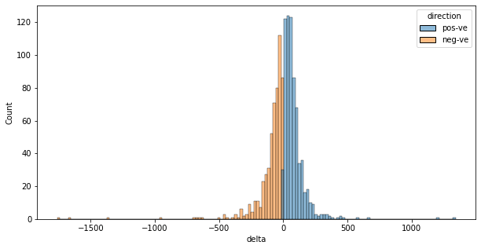

```python
%load_ext autoreload
%autoreload 2
```


```python
import pathlib
import sys
import os
```


```python
def setupSysPath():
    cwd = os.getcwd()
    parent = str(pathlib.Path(cwd).parent)
    if parent not in sys.path:
        sys.path.insert(0, parent)
    return
```


```python
setupSysPath()
```

# HC


```python
import itertools
import datetime
```


```python
import hc.data.fmp as fmp
import hc.ranges.ranges as ranges
import hc.utils.ranges as rangeUtils
import hc.utils.scores as scores
import hc.utils.labels as labels
import hc.utils.ml as ml
```


```python
CAPITAL = 100
TICKER = "SPY"
STOP_LOSS = 0.005
MA_WINDOW = 26
EVENT_MA_WINDOW = 13
```

### Strategy - Exploration


```python
hd = fmp.getHistoricalDaily(TICKER)
```


```python
hdClose = hd.toClass(ranges.PriceRange, price = fmp.fmpClose)
hdDates = hd.toClass(ranges.DateRange, date = fmp.fmpDate)
```


```python
(hdClose
 .zipWith(hdDates)
 .t()
 .toLinePlot(cols = ["close", "date"], x = "date", y = "close", legend = False)
)
```


    

    


```python
(hdClose
 .lWindowDiff(2)
 .zipWith(
     hdClose.lWindowDiff(2).map(labels.labelPosNegZero),
     hdDates
 )
 .t()
 .toScatterPlot(
     cols = ["delta", "direction", "date"], 
     x = "date", 
     y = "delta",
     categoryKey = "direction"
 )
)
```


    

    


```python
(hdClose
 .lWindowDiff(2)
 .filterZero(False)
 .zipWith(
     hdClose.lWindowDiff(2).filterZero(False).map(labels.labelPosNeg)
 )
 .t()
 .toHistPlot(
     cols = ["delta", "direction"], 
     x = "delta", 
     y = None,
     categoryKey = "direction"
 )
)
```


    

    


```python
(hdClose
 .lWindowDiff(2).take(hdClose.length() - 1)
 .zipWith(hdClose.lWindowDiff(2).tail(hdClose.length() - 1))
 .t()
 .appendOne(hdClose.lWindowDiff(2).tail(hdClose.length() - 1).map(labels.labelPosNegZero))
 .toJointDensityPlot(
     cols = ["delta (T - 0)", "delta (T - 1)", "direction"], 
     x = "delta (T - 0)", 
     y = "delta (T - 1)",
     categoryKey = "direction"
 )
)
```


    

    


### Strategy - EWMA Momentum


```python
(rangeUtils.join(
    hdClose,
    hdClose.wma(ranges.ExpWeights.fromWindow(MA_WINDOW)),
    hdClose.wma(ranges.ExpWeights.fromWindow(200))
)
 .zipWith(
     rangeUtils.join(
         rangeUtils.repeat("1D", hd.length(), ranges.Range),
         rangeUtils.repeat(str(MA_WINDOW) + "D", hd.length(), ranges.Range),
         rangeUtils.repeat("200D", hd.length(), ranges.Range)
     ),
     hdDates.repeat(3).join()
 )
 .t()
 .toLinePlot(
     cols = ["ewma", "window", "date"], 
     x = "date", y = "ewma", categoryKey = "window"
 )
)
```


    

    


```python
(hdClose
 .subtract(hdClose.wma(ranges.ExpWeights.fromWindow(MA_WINDOW)))
 .take(hdClose.length() - 1)
 .zipWith(
     hdClose.lWindowDiff(2).tail(hdClose.length() - 1),
     (hdClose
      .subtract(hdClose.wma(ranges.ExpWeights.fromWindow(MA_WINDOW)))
      .take(hdClose.length() - 1)
      .map(labels.labelPosNegZero)
     )
 )
 .t()
 .toJointDensityPlot(
     cols = ["close - ewma (MA_WINDOWD)", "delta", "indicator"], 
     x = "delta", 
     y = "close - ewma (MA_WINDOWD)",
     categoryKey = "indicator"
 )
)
```


    

    


```python
(rangeUtils
 .repeat(1, hdClose.length(), ranges.Range)
 .toClass(ranges.IndicatorRange)
 .weightedAlloc(hdClose, CAPITAL)
 .pnl(hdClose)
 .rocCum(CAPITAL)
 .zipWith(hdDates)
 .t()
 .toLinePlot(["return", "date"], "date", "return")
)
```


    

    


```python
hdCloseIndicator = hdClose.subtract(hdClose.wma(ranges.ExpWeights.fromWindow(MA_WINDOW)))
```


```python
(hdCloseIndicator
 .booleanIndicator()
 .weightedAlloc(hdClose, CAPITAL, stopLoss = None)
 .pnl(hdClose)
 .rocCum(CAPITAL)
 .zipWith(
     hdDates,
     (hdCloseIndicator
      .booleanIndicator()
      .map(labels.labelPosNegZero)
     )
 )
 .t()
 .toScatterPlot(
     cols = ["return", "date", "position"], 
     x = "date", 
     y = "return",
     categoryKey = "position"
 )
)
```


    

    


```python
(hdCloseIndicator
 .booleanIndicator()
 .weightedAlloc(hdClose, CAPITAL, stopLoss = STOP_LOSS)
 .pnl(hdClose)
 .rocCum(CAPITAL)
 .zipWith(
     hdDates,
     (hdCloseIndicator
      .booleanIndicator()
      .map(labels.labelPosNegZero)
     )
 )
 .t()
 .toScatterPlot(
     cols = ["return", "date", "position"], 
     x = "date", 
     y = "return",
     categoryKey = "position"
 )
)
```


    

    


```python
(hdCloseIndicator
 .booleanIndicator(longOnly = True)
 .weightedAlloc(hdClose, CAPITAL, stopLoss = None)
 .pnl(hdClose)
 .rocCum(CAPITAL)
 .zipWith(hdDates)
 .t()
 .toScatterPlot(
     cols = ["return", "date"],
     x = "date", 
     y = "return"
 )
)
```


    

    


```python
(hdCloseIndicator
 .booleanIndicator(longOnly = True)
 .weightedAlloc(hdClose, CAPITAL, stopLoss = STOP_LOSS)
 .pnl(hdClose)
 .rocCum(CAPITAL)
 .zipWith(hdDates)
 .t()
 .toScatterPlot(
     cols = ["return", "date", "position"], 
     x = "date", 
     y = "return"
 )
)
```


    

    


### Strategy - EWMA Momentum weighted by Key US Economic Dates


```python
usEconEvents = (
    fmp
    .getCalendar(datetime.date(2017, 1, 1), datetime.date(2021, 7, 1))
    .filter(fmp.eventHasCountry("US"))
    .filter(lambda e: (
        "WASDE" not in e["event"]
        and "EIA" not in e["event"]
        and "1920" not in e["event"]
        and "2021" not in e["event"]
    ))
)
fmp.summariseCalendar(usEconEvents)
```


    {'Length': 5344,
     'Min Date': '2019-12-23',
     'Max Date': '2021-06-30',
     'Example': {'event': 'United States Cold Storage Cold Storage Beef Stocks',
      'date': '2019-12-23',
      'country': 'US',
      'actual': 480.382,
      'previous': 466.219,
      'change': 14.163,
      'changePercentage': 0.0304,
      'estimate': None}}


```python
usEconEvents.map(lambda e: e["event"]).unique().length()
```


    439


```python
usEconEventsClusters = ml.clusterEventsByTextEmbedding(
    usEconEvents, 
    model = "kmeans",
    n_clusters = 80
)
```


```python
(usEconEvents
 .map(lambda e: e["event"])
 .unique()
 .groupBy(lambda e: usEconEventsClusters[e])
 .map(lambda es: es.toList())
 .take(10)
 .toList()
)
```


    [['Average Hourly Earnings (YoY)',
      'Consumer Price Index (MoM)',
      'Consumer Price Index (YoY)',
      'Consumer Price Index n.s.a (MoM)',
      'Export Price Index (MoM)',
      'Export Price Index (YoY)',
      'Housing Price Index (MoM)',
      'Import Price Index (MoM)',
      'Import Price Index (YoY)',
      'Producer Price Index (MoM)',
      'Producer Price Index (YoY)',
      'Redbook Index (MoM)',
      'Redbook Index (YoY)'],
     ['Building Permits Change',
      'United States Budget Personal Income MM',
      'United States Build Permits revised Build Permits R Chg MM',
      'United States Build Permits revised Build Permits R Numb',
      'United States Construction Construction Spending MM',
      'United States Consumption Personal Consump Real MM',
      'United States House Starts Build Permits: Change MM',
      'United States House Starts Build Permits: Change MM ',
      'United States House Starts Building Permits: Number',
      'United States House Starts Building Permits: Number ',
      'United States Housing Stats House Starts MM: Change',
      'United States Housing Stats House Starts MM: Change ',
      'United States Pending homes Pending Sales Change MM'],
     ['United States CPI Real Weekly Earnings MM',
      'United States Consumption Core PCE Price Index MM',
      'United States Consumption Core PCE Price Index YY',
      'United States Consumption PCE Price Index MM',
      'United States Consumption PCE Price Index YY',
      'United States GDP Advance Core PCE Prices Advance',
      'United States GDP Advance PCE Prices Advance',
      'United States GDP Final Core PCE Prices Fnal',
      'United States Leading indicator Leading Index Chg MM',
      'United States PCE Price Index Dallas Fed PCE'],
     ['United States ISM   man ISM Manuf Employment Idx',
      'United States ISM   man ISM Manuf New Orders Idx',
      'United States ISM   man ISM Manufacturing PMI',
      'United States ISM   man ISM Mfg Prices Paid',
      'United States ISM   non man ISM N Mfg Bus Act',
      'United States ISM   non man ISM N Mfg Employment Idx',
      'United States ISM   non man ISM N Mfg New Orders Idx',
      'United States ISM   non man ISM N Mfg PMI',
      'United States ISM   non man ISM N Mfg Price Paid Idx',
      'United States New York NAPM index ISM NY Biz Conditions'],
     ['United States Chicago PMI Chicago PMI',
      'United States Composite PMI Markit Comp Flash PMI',
      'United States Markit PMI Final Markit Mfg PMI Final',
      'United States Markit PMI Flash Markit Mfg PMI Flash',
      'United States Mkit services Flash Markit Svcs PMI Flash',
      'United States PMI Markit Comp Final PMI',
      'United States Services PMI Markit Svcs PMI Final'],
     ["Fed's Chair Powell speech",
      "Fed's Chair Powell testifies",
      "Fed's Daly speech",
      "Fed's Evans speech",
      "Fed's George speech",
      "Fed's Williams speech",
      "Martin L. King's Birthday"],
     ['Baker Hughes US Oil Rig Count',
      'CFTC Gold NC Net Positions',
      'CFTC Oil NC Net Positions',
      'COVID-19 Vaccine announcement',
      "Presidents' Day",
      'United States Business Optm Idx NFIB Business Optimism Idx',
      'United States ExportSales Corn Exp Sale Next Yr Net',
      'United States ExportSales Corn Exp Sales Net Total',
      'United States ExportSales Soybean Exp Sale Net Total',
      'United States ExportSales Soybean Exp Sale Next Yr Net',
      'United States ExportSales Soybeanmeal Exp Sale Net',
      'United States ExportSales Soybeanoil Exp Sales Net',
      'United States ExportSales Soybn Meal Exp Sls Net Total',
      'United States ExportSales Soybn Oil Exp Sls Net Total',
      'United States ExportSales Soybn Oil Exp Sls Nxt Yr Net',
      'United States ExportSales Soymeal Exp Sls Next Yr Net',
      'United States ExportSales Up Cotton Exp Sales Net',
      'United States ExportSales Wheat Exp Sale Net Total',
      'United States ExportSales Wheat Exp Sale Next Yr Net',
      'United States Hog InventoryQuarterly Quarterly Hog Inventory',
      'United States NOPA Soya Crush Bean Oil Stocks',
      'United States NOPA Soya Crush NOPA Soy Crush',
      'United States Net flows Net L T Flows,Exswaps',
      'United States Net flows Net L T Flows,Incl.Swaps',
      'United States Shiller Home Prices CaseShiller 20 YY'],
     ['Average Hourly Earnings (MoM)',
      'Existing Home Sales (MoM)',
      'Existing Home Sales Change (MoM)',
      'New Home Sales (MoM)',
      'New Home Sales Change (MoM)',
      'Pending Home Sales (MoM)',
      'Pending Home Sales (YoY)',
      'Personal Income (MoM)',
      'Retail Sales (MoM)',
      'Retail Sales ex Autos (MoM)'],
     ['ISM Manufacturing Employment Index',
      'ISM Manufacturing PMI',
      'ISM Services PMI'],
     ['United States Employment Government Payrolls',
      'United States Employment Labor Force Partic',
      'United States Employment Manufacturing Payrolls',
      'United States Employment Non Farm Payrolls',
      'United States Employment Private Payrolls',
      'United States Employment U6 Underemployment',
      'United States Employmentunemployment Employment Trends']]


```python
usEconDates = usEconEvents.map(lambda v: v["date"])
```


```python
hdWithUSEvents = hd.tail(
    hd.filter(lambda v: v["date"] > min(usEconDates)).length() + 50
)
```


```python
hdWithUSEventsClose = hdWithUSEvents.map(lambda v: v["close"]).toClass(ranges.PriceRange)
hdWithUSEventsDates = hdWithUSEvents.map(lambda v: v["date"]).toClass(ranges.DateRange)
```


```python
eventsWithInformationScore = (
    usEconEvents
    .groupBy(lambda e: usEconEventsClusters[e["event"]])
    .map(lambda es: es.map(lambda e: e["event"]).unique())
    .map(lambda es: [
        es.toList(),
        scores.eventInformationScore(hd, es, MA_WINDOW, EVENT_MA_WINDOW)
    ])
)
```


```python
eventsByInformationScore = eventsWithInformationScore.sortBy(lambda es: es[1])
```


```python
topEvents = eventsByInformationScore.tail(10).map(lambda es: es[0])
```


```python
topEvents.take(10).toList()
```


    [['United States Employment Government Payrolls',
      'United States Employment Labor Force Partic',
      'United States Employment Manufacturing Payrolls',
      'United States Employment Non Farm Payrolls',
      'United States Employment Private Payrolls',
      'United States Employment U6 Underemployment',
      'United States Employmentunemployment Employment Trends'],
     ['United States Consumption Consumption, Adjusted MM',
      'United States Empire State NY Fed Manufacturing',
      'United States ExportSales Up Cotton Exp Sales New',
      'United States Grain stocks Qtrly Grain Stocks Corn',
      'United States Grain stocks Qtrly Grain Stocks Soy',
      'United States Grain stocks Qtrly Grain Stocks Wheat',
      'United States ImportsExports Export Prices MM',
      'United States ImportsExports Import Prices MM',
      'United States Industrial production Capacity Utilization SA',
      'United States Industrial production Industrial Production MM',
      'United States Industrial production Industrial Production YoY',
      'United States Industrial production Manuf Output MM',
      'United States Wholesale Wholesale Sales MM'],
     ['ADP Employment Change', 'United States ADP ADP National Employment'],
     ['United States ISM   man ISM Manuf Employment Idx',
      'United States ISM   man ISM Manuf New Orders Idx',
      'United States ISM   man ISM Manufacturing PMI',
      'United States ISM   man ISM Mfg Prices Paid',
      'United States ISM   non man ISM N Mfg Bus Act',
      'United States ISM   non man ISM N Mfg Employment Idx',
      'United States ISM   non man ISM N Mfg New Orders Idx',
      'United States ISM   non man ISM N Mfg PMI',
      'United States ISM   non man ISM N Mfg Price Paid Idx',
      'United States New York NAPM index ISM NY Biz Conditions'],
     ['Business Inventories',
      'United States Business inventories Business Inventories MM',
      'United States Business inventories Business Inventories MM ',
      'United States Business inventories Retail Inventories Ex Auto Rev',
      'United States Business inventories Retail Inventories Ex Auto Rev '],
     ['United States Corporate Profits Prelim Corporate Profits Prelim',
      'United States Corporate Profits Revise Corporate Profits Revised',
      'United States Employment Average Earnings MM',
      'United States Employment Average Earnings YY',
      'United States Employment Average Workweek Hrs',
      'United States FHFA monthly Monthly Home Price Index',
      'United States FHFA monthly Monthly Home Price MM',
      'United States FHFA monthly Monthly Home Price YY',
      'United States Productivity Prelim Labor Costs Prelim'],
     ['Retail Sales Control Group',
      'Total Vehicle Sales',
      'United States Retail Sales Retail Control',
      'United States Retail Sales Retail Control ',
      'United States Retail Sales Retail Ex GasAutos',
      'United States Retail Sales Retail Ex GasAutos ',
      'United States Retail Sales Retail Sales Ex Autos MM',
      'United States Retail Sales Retail Sales Ex Autos MM ',
      'United States Retail Sales Retail Sales MM',
      'United States Retail Sales Retail Sales MM ',
      'United States Retail Sales Retail Sales YoY'],
     ['United States CPI CPI Index  SA',
      'United States CPI CPI Index, NSA',
      'United States CPI CPI MM NSA',
      'United States CPI CPI MM, SA',
      'United States CPI CPI YY, NSA',
      'United States CPI Core CPI Index, SA',
      'United States CPI Core CPI MM, SA',
      'United States CPI Core CPI YY, NSA'],
     ['United States IPSOS PCSI Refinitiv IPSOS PCSI',
      'United States IPSOS PCSI TR IPSOS PCSI'],
     ['United States Michigan subindexes Prelim U Mich 1Yr Inf Prelim',
      'United States Michigan subindexes Prelim U Mich 5 Yr Inf Prelim',
      'United States Michigan subindexes Prelim U Mich Conditions Prelim',
      'United States Michigan subindexes Prelim U Mich Expectations Prelim',
      'United States Michigan subindexes Prelim U Mich Sentiment Prelim']]


```python
def filterTopEvents(filteredTopEvents, n):
    while filteredTopEvents.length() > n:
        filteredTopEvents = filteredTopEvents.atIndices((
            ranges.Range(itertools.combinations(
                filteredTopEvents.toList(), filteredTopEvents.length() - 1
            ))
            .map(lambda es: [
                list(es),
                scores.eventInformationScore(hd, sum(es, []), MA_WINDOW, EVENT_MA_WINDOW)
            ])
            .enumerate()
            .sortBy(lambda es: es[1][1])
            .tail(filteredTopEvents.length() - 1)
            .map(lambda es: es[0])
        ))
    return filteredTopEvents
```


```python
# filteredTopEvents = filterTopEvents(topEvents, 15)
```


```python
usKeyEvents = (
    fmp
    .getCalendar(datetime.date(2017, 1, 1), datetime.date(2021, 7, 1))
    .filter(fmp.eventHasCountry("US"))
    .filter(fmp.eventIsNamed(sum(topEvents.toList(), [])))
)
fmp.summariseCalendar(usKeyEvents)
```


    {'Length': 642,
     'Min Date': '2019-12-27',
     'Max Date': '2021-06-30',
     'Example': {'event': 'United States ExportSales Up Cotton Exp Sales New',
      'date': '2019-12-27',
      'country': 'US',
      'actual': 158.2,
      'previous': 254.2,
      'change': -96.0,
      'changePercentage': -0.3777,
      'estimate': None}}


```python
usKeyDates = usKeyEvents.map(lambda v: v["date"])
```


```python
usKeyDateIndicator = (
    hdWithUSEventsDates
    .map(lambda d: 1 if d in usKeyDates else 0.2)
    .toClass(ranges.IndicatorRange)
)
```


```python
(usKeyDateIndicator
 .wma(ranges.ExpWeights.fromWindow(EVENT_MA_WINDOW))
 .zipWith(hdWithUSEventsDates)
 .t()
 .toScatterPlot(
     cols = ["Econ Date", "date"], x = "date", y = "Econ Date"
 )
)
```


    

    


```python
(rangeUtils.join(
    hdWithUSEventsClose,
    hdWithUSEventsClose.wma(ranges.ExpWeights.fromWindow(MA_WINDOW)),
    hdWithUSEventsClose.wma(ranges.ExpWeights.fromWindow(200))
)
 .zipWith(
     rangeUtils.join(
         rangeUtils.repeat("1D", hdWithUSEventsClose.length(), ranges.Range),
         rangeUtils.repeat(str(MA_WINDOW) + "D", hdWithUSEventsClose.length(), ranges.Range),
         rangeUtils.repeat("200D", hdWithUSEventsClose.length(), ranges.Range)
     ),
     hdWithUSEventsDates.repeat(3).join()
 )
 .t()
 .toLinePlot(
     cols = ["ewma", "window", "date"], 
     x = "date", y = "ewma", categoryKey = "window"
 )
)
```


    

    


```python
(rangeUtils.join(
    hdWithUSEventsClose,
    hdWithUSEventsClose.wma(ranges.ExpWeights.fromWindow(MA_WINDOW)),
    hdWithUSEventsClose.wmaAdj(
        ranges.ExpWeights.fromWindow(MA_WINDOW), 
        usKeyDateIndicator.wma(ranges.ExpWeights.fromWindow(EVENT_MA_WINDOW))
    ),
    hdWithUSEventsClose.wma(ranges.ExpWeights.fromWindow(200))
)
 .zipWith(
     rangeUtils.join(
         rangeUtils.repeat("1D", hdWithUSEventsClose.length(), ranges.Range),
         rangeUtils.repeat(str(MA_WINDOW) + "D", hdWithUSEventsClose.length(), ranges.Range),
         rangeUtils.repeat(str(MA_WINDOW) + "D - adj", hdWithUSEventsClose.length(), ranges.Range),
         rangeUtils.repeat("200D", hdWithUSEventsClose.length(), ranges.Range)
     ),
     hdWithUSEventsDates.repeat(4).join()
 )
 .t()
 .toLinePlot(
     cols = ["ewma", "window", "date"], 
     x = "date", y = "ewma", categoryKey = "window"
 )
)
```


    

    


```python
hdWithUSEventsCloseIndicator = (
    hdWithUSEventsClose
    .subtract(hdWithUSEventsClose.wma(ranges.ExpWeights.fromWindow(MA_WINDOW)))
)
```


```python
(hdWithUSEventsCloseIndicator
 .booleanIndicator()
 .weightedAlloc(hdWithUSEventsClose, CAPITAL, stopLoss = None)
 .pnl(hdWithUSEventsClose)
 .rocCum(CAPITAL)
 .zipWith(
     hdWithUSEventsDates,
     (hdWithUSEventsCloseIndicator
      .booleanIndicator()
      .map(labels.labelPosNegZero)
     )
 )
 .t()
 .toScatterPlot(
     cols = ["return", "date", "position"], 
     x = "date", 
     y = "return", 
     categoryKey = "position"
 )
)
```


    

    


```python
(hdWithUSEventsCloseIndicator
 .booleanIndicator()
 .weightedAlloc(hdWithUSEventsClose, CAPITAL, stopLoss = STOP_LOSS)
 .pnl(hdWithUSEventsClose)
 .rocCum(CAPITAL)
 .zipWith(
     hdWithUSEventsDates,
     (hdWithUSEventsCloseIndicator
      .booleanIndicator()
      .map(labels.labelPosNegZero)
     )
 )
 .t()
 .toScatterPlot(
     cols = ["return", "date", "position"], 
     x = "date", 
     y = "return", 
     categoryKey = "position"
 )
)
```


    

    


```python
(hdWithUSEventsCloseIndicator
 .booleanIndicator(longOnly = True)
 .weightedAlloc(hdWithUSEventsClose, CAPITAL, stopLoss = None)
 .pnl(hdWithUSEventsClose)
 .rocCum(CAPITAL)
 .zipWith(hdWithUSEventsDates)
 .t()
 .toScatterPlot(
     cols = ["return", "date"], 
     x = "date", 
     y = "return"
 )
)
```


    

    


```python
(hdWithUSEventsCloseIndicator
 .booleanIndicator(longOnly = True)
 .weightedAlloc(hdWithUSEventsClose, CAPITAL, stopLoss = STOP_LOSS)
 .pnl(hdWithUSEventsClose)
 .rocCum(CAPITAL)
 .zipWith(hdWithUSEventsDates)
 .t()
 .toScatterPlot(
     cols = ["return", "date"], 
     x = "date", 
     y = "return"
 )
)
```


    

    


```python
hdWithUSEventsCloseAdjIndicator = (
    hdWithUSEventsClose
    .subtract(hdWithUSEventsClose.wmaAdj(
        ranges.ExpWeights.fromWindow(MA_WINDOW), 
        usKeyDateIndicator.wma(ranges.ExpWeights.fromWindow(EVENT_MA_WINDOW))
    ))
)
```


```python
(hdWithUSEventsCloseAdjIndicator
 .booleanIndicator()
 .weightedAlloc(hdWithUSEventsClose, CAPITAL, stopLoss = None)
 .pnl(hdWithUSEventsClose)
 .rocCum(CAPITAL)
 .zipWith(
     hdWithUSEventsDates,
     (hdWithUSEventsCloseAdjIndicator
      .booleanIndicator()
      .map(labels.labelPosNegZero)
     )
 )
 .t()
 .toScatterPlot(
     cols = ["return", "date", "position"], 
     x = "date", 
     y = "return", 
     categoryKey = "position"
 )
)
```


    

    


```python
(hdWithUSEventsCloseAdjIndicator
 .booleanIndicator()
 .weightedAlloc(hdWithUSEventsClose, CAPITAL, stopLoss = STOP_LOSS)
 .pnl(hdWithUSEventsClose)
 .rocCum(CAPITAL)
 .zipWith(
     hdWithUSEventsDates,
     (hdWithUSEventsCloseAdjIndicator
      .booleanIndicator()
      .map(labels.labelPosNegZero)
     )
 )
 .t()
 .toScatterPlot(
     cols = ["return", "date", "position"], 
     x = "date", 
     y = "return", 
     categoryKey = "position"
 )
)
```


    

    


```python
(hdWithUSEventsCloseAdjIndicator
 .booleanIndicator(longOnly = True)
 .weightedAlloc(hdWithUSEventsClose, CAPITAL, stopLoss = None)
 .pnl(hdWithUSEventsClose)
 .rocCum(CAPITAL)
 .zipWith(hdWithUSEventsDates)
 .t()
 .toScatterPlot(
     cols = ["return", "date"], 
     x = "date", 
     y = "return"
 )
)
```


    

    


```python
(hdWithUSEventsCloseAdjIndicator
 .booleanIndicator(longOnly = True)
 .weightedAlloc(hdWithUSEventsClose, CAPITAL, stopLoss = STOP_LOSS)
 .pnl(hdWithUSEventsClose)
 .rocCum(CAPITAL)
 .zipWith(hdWithUSEventsDates)
 .t()
 .toScatterPlot(
     cols = ["return", "date"], 
     x = "date", 
     y = "return"
 )
)
```


    

    


### Strategy - Combining Indicators


```python

```

### Strategy - Extensions

- Combine (as above) EWMA indicators with:
    - Asset specific fundamental indicators (eg. PE, CFROI, etc.).
    - Macro-economic fundamental indicators (yield curves, fx, rates, etc.).
    - Other economic fundamental indicators (eg. calendar prints included above, etc.).
        - Ideally, from a time series of predictions / expectations per data point.

- Extend date weighting with:
    - Other asset specific events (equity earnings releases, analyst updates, etc.).
    - Weighting by 'unexpectedness' of new data (announced vs expected).

### Strategy - Work in progress


```python
(rangeUtils.join(
    hdClose.wmstd(ranges.ExpWeights.fromWindow(2)),
    hdClose.wmstd(ranges.ExpWeights.fromWindow(MA_WINDOW)),
    hdClose.wmstd(ranges.ExpWeights.fromWindow(50)),
    hdClose.wmstd(ranges.ExpWeights.fromWindow(200))
)
 .zipWith(
     rangeUtils.join(
         rangeUtils.repeat("2D", hd.length(), ranges.Range),
         rangeUtils.repeat(str(MA_WINDOW) + "D", hd.length(), ranges.Range),
         rangeUtils.repeat("50D", hd.length(), ranges.Range),
         rangeUtils.repeat("200D", hd.length(), ranges.Range)
     ),
     hdDates.repeat(4).join()
 )
 .t()
 .toLinePlot(
     cols = ["ewmstd", "window", "date"], 
     x = "date", y = "ewmstd", categoryKey = "window"
 )
)
```


    

    


```python
(rangeUtils.join(
    (hdClose
     .wma(ranges.ExpWeights.fromWindow(MA_WINDOW))
     .subtract(hdClose.wma(ranges.ExpWeights.fromWindow(2)))
    ),
    (hdClose
     .wma(ranges.ExpWeights.fromWindow(50))
     .subtract(hdClose.wma(ranges.ExpWeights.fromWindow(MA_WINDOW)))
    )
)
 .zipWith(
     rangeUtils.join(
         rangeUtils.repeat(str(MA_WINDOW) + "D - 2D", hd.length(), ranges.Range),
         rangeUtils.repeat("50D - " + str(MA_WINDOW) + "D", hd.length(), ranges.Range)
     ),
     hdDates.repeat(2).join()
 )
 .t()
 .toLinePlot(
     cols = ["ewma", "window", "date"], 
     x = "date", y = "ewma", categoryKey = "window"
 )
)
```


    

    


```python

```
